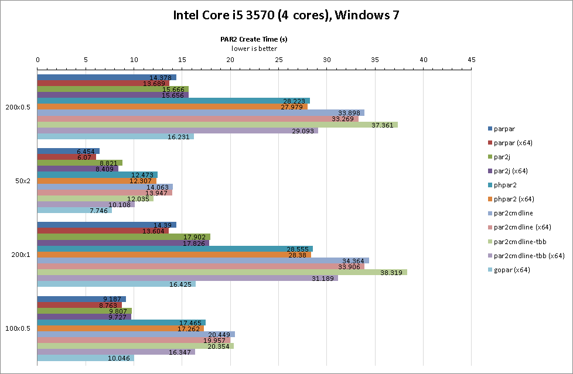
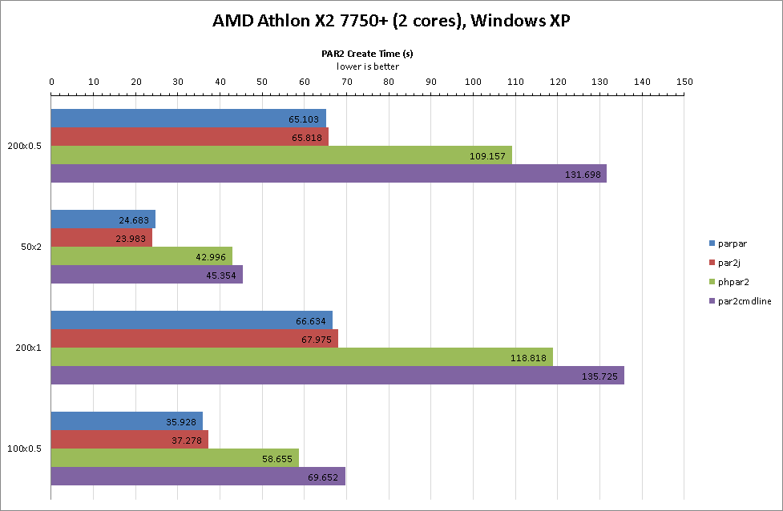
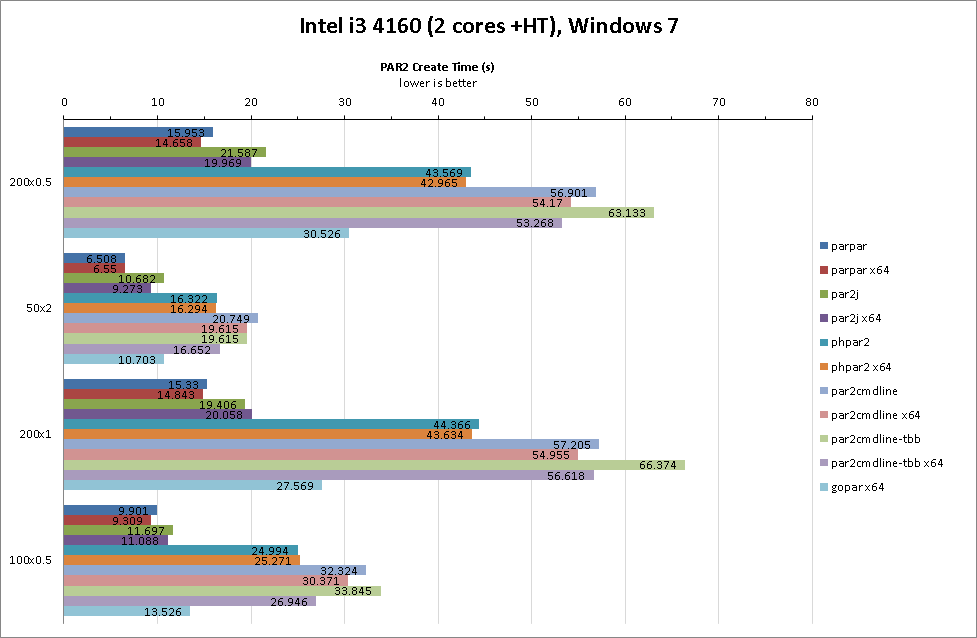
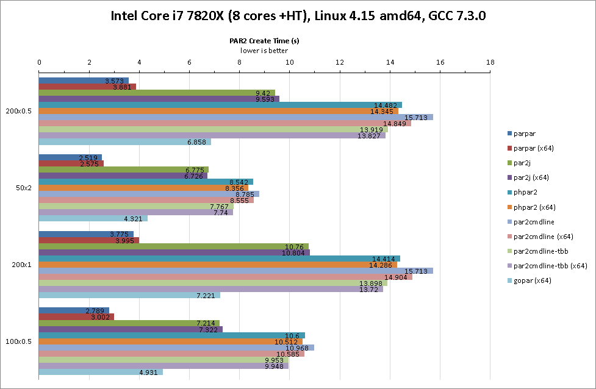
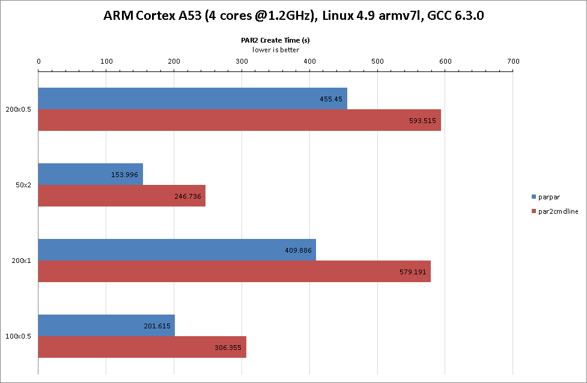

These are some non-exhaustive, non-scientific benchmarks comparisons of all the
PAR2 creators I could find.

Benchmark Sets
--------------

All these tests were done on a single 1GB file of random data.

1.  200 x 512KB recovery slices (100MB recovery data)

2.  50 x 2MB recovery (100MB)

3.  200 x 1MB recovery (200MB)

4.  100 x 512KB recovery (50MB)

 

Sample Benchmark Results
========================

(par2cmdline/tbb was compiled with `-march=native` to match ParPar)

(gopar excluded due to insufficient RAM)

Benchmark Details
=================

Applications Tested (and commands given)
----------------------------------------

-   [ParPar 0.3.0](https://animetosho.org/app/parpar) [2018-05-17]

    -   `parpar -s [blocksize]b -r [rblocks] -m 2000M -o [output] [input]`

-   [par2j from MultiPar 1.2.9.9](http://hp.vector.co.jp/authors/VA021385)
    [2016-12-16]

    -   `par2j c -ss [blocksize] -rn [rblocks] -rf1 -in -m7 [output] [input]`

-   [phpar2 1.5](http://www.paulhoule.com/phpar2/index.php) [2017-11-14]

    -   `phpar2 c -s [blocksize] -c [rblocks] -n1 -m 2000 [output] [input]`

-   [par2cmdline 0.8.0 (BlackIkeEagle’s
    fork)](https://github.com/Parchive/par2cmdline) [2017-12-12]

    -   `par2 c -s [blocksize] -c [rblocks] -n1 -m 2000 [output] [input]`

-   [par2cmdline-0.4-tbb-20150503](https://web.archive.org/web/20150516233245/www.chuchusoft.com/par2_tbb/download.html)
    [2015-05-03]

    -   `par2_tbb c -s [blocksize] -c [rblocks] -n1 -m 2000 [output] [input]`

    -   At time of writing, ChuChuSoft’s website was down. Windows binaries can
        be found in the [SABnzbd 0.8.0
        package](https://sourceforge.net/projects/sabnzbdplus/files/), and
        source code [can be found
        here](https://github.com/jcfp/par2tbb-chuchusoft-sources/releases/)

    -   [TBB won't work on non-x86 CPUs, or older versions of
        Windows](https://www.threadingbuildingblocks.org/system-requirements)

-   [gopar](https://github.com/akalin/gopar) [2018-03-18]

    -   `gopar -g [threads] c -s [blocksize] -c [rblocks] [output].par2 [input]`

    -   Gopar seems to be a relatively simple implementation at the moment, so
        comparing against fully fledged clients is perhaps unfair, but is still
        be an interesting point of reference

    -   32-bit builds seem to be problematic as it runs out of memory in this
        benchmark (it seems like gopar reads everything into memory at this
        stage), and doesn’t have assembly optimisations implemented, so only x64
        builds have been tested

### Notes

-   GF multiplication is one of the main underlying components of performance
    for PAR2 generation, and hence the algorithm used (as well as particular
    implementation) plays a big role in the resulting performance. I believe
    that the following algorithms are used:

    -   all par2cmdline forks (including phpar2) use the “LH lookup” algorithm
        (8-bit LH lookup table). phpar2 and par2cmdline-tbb have MMX optimised
        routines whilst par2cmdline uses a generic implementation

    -   gopar (x64) will use a 128-bit “shuffle” algorithm (4-bit vector table
        lookup) if the CPU supports
        [SSSE3](https://en.wikipedia.org/wiki/SSSE3#CPUs_with_SSSE3), otherwise
        a generic “LH lookup” algorithm is used

    -   par2j will select an algorithm depending on CPU capabilities in the
        following order: 256-bit “shuffle”
        ([AVX2](https://en.wikipedia.org/wiki/Advanced_Vector_Extensions#CPUs_with_AVX2)
        capable CPU required), 128-bit “shuffle” (SSSE3), 128-bit “XOR” (JIT
        code to XOR bit dependencies; requires SSE2), “LH lookup” (MMX/generic)

    -   ParPar will select an algorithm based on a number of rules on which CPU
        it is running on. It includes the following algorithms: 128-bit
        (SSE2/SSSE3/NEON), 256-bit (AVX2) and 512-bit
        ([AVX512BW](https://en.wikipedia.org/wiki/AVX-512#CPUs_with_AVX-512))
        widths for “shuffle” and “XOR” algorithms and “LH lookup” (generic
        implementation). There’s also an experimental “affine” (8x8-bit LH
        affine transform; requires GFNI) algorithm at 128 and 512-bit widths,
        but isn’t ever selected automatically as [no currently available CPU
        supports
        GFNI](https://fuse.wikichip.org/news/1158/intel-discloses-tremont-a-goldmont-plus-successor/).

    Algorithm selection should have the following effect on performance:

    -   “LH lookup” is the slowest of the bunch, but is the only algorithm which
        can be implemented in pure C (and hence is cross platform). MMX/SSE
        optimized variants are faster but no longer cross-platform.

    -   “XOR” and “shuffle” are roughly comparable in terms of performance.
        Generally “XOR” is faster than “shuffle” at 128-bit widths, whilst the
        reverse is true at 512-bit widths

    -   Higher bit-widths outperform smaller bit-widths

-   par2j and phpar2 are Windows only, all other applications are cross
    platform. On x86 Linux, these tools were run under Wine

-   all applications except Gopar have pre-built Windows binaries, which is what
    was used for Windows benchmarking. Gopar was built using Go 1.10 for all
    benchmarks

-   GPU based tools aren’t investigated here as they are currently of no
    interest to me. Benchmarks here are CPU only. par2j and par2cmdline-tbb are
    the only clients with GPU support

-   memory limits were generously set as possible so that it wasn’t a limiting
    factor. Whilst this would be nice to test, how applications decide to use
    memory can vary, and par2j uses a different scheme to other applications,
    which makes it difficult to do a fair comparison

    -   My ARM board only has 1GB RAM, so I’ve adjusted the memory limit down to
        800MB

Applications Not Tested
-----------------------

The only other complete-ish implementation of PAR2 I could find is
[QuickPar](http://www.quickpar.org.uk/). This is a Windows-only GUI application
which hasn't been updated since 2004, and no source code available. The
application has largely be superseeded by newer clients, and considering its
single threaded nature, is unlikely competitive by today's standards.

Running Your Own Benchmarks
===========================

The test runner used in the above benchmarks, *bench.js*, is included here so
that you can run your own tests. Note that there are a few things you need to be
aware of for it to work:

-   files (input and output) will be written to the temp directory if the `TMP`
    or `TEMP` environment variable is set, falling back to the current working
    directory

-   executables should be placed in the current working directory

-   naming (append .exe where necessary; if running on x64 OS, both 32-bit and
    64-bit variants are tested, so name appropriately):

    -   par2cmdline should be named **par2** and **par2_64**

    -   par2cmdline-tbb should be named **par2_tbb** and **par2_tbb64**

    -   par2j uses default EXE names **par2j** and **par2j64**; for bencmarking
        these on Linux, make sure wine is installed

    -   phpar2 should be named **phpar2** and **phpar2_64**; on Linux, make sure
        Wine is installed

    -   gopar should be named **gopar** and **gopar64**. Note that gopar
        (32-bit) is disabled by default due to it running out of memory on this
        benchmark, but you can enable it by uncommenting the relevant code

    -   on Windows, parpar should be named **parpar** and **parpar64**; on
        Linux, a script named **parpar** and/or **parpar64** which should run
        the appropriate command  
        Example parpar bash script: `nodejs _parpar/bin/parpar.js $*`  
        Alternatively, you can run ParPar via `node` on Windows by placing a
        **parpar.cmd** and/or **parpar64.cmd** instead of the EXE versions and
        using a command like `@"%~dp0\parpar\bin\node.exe"
        "%~dp0\parpar\bin\parpar.js" %*`

-   results will be printed out in CSV format. I haven’t bothered with
    stdout/stderr differentiation, so just copy/paste the relevant data into a
    CSV file

-   as memory limits have been set quite high for most tests, ensure your system
    has enough free RAM for a fair comparison (if you need to change this,
    search for “2000” in the code and change to something else - note that
    memory cannot be adjusted with gopar, so if you don’t have enough, you may
    need to disable gopar benchmarks)

-   the *async* library is required (`npm install async` will get what you need)
